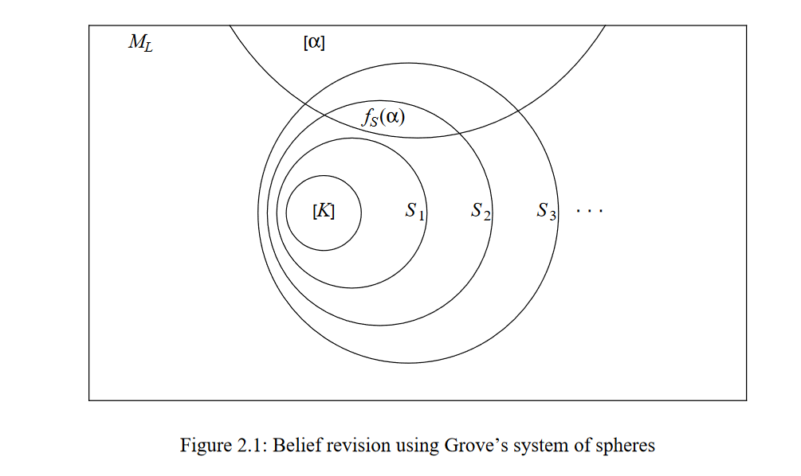

> Excerpt From:

# Belief Revision: A Computational Approach

by Simon Edmund Dixon

## 2.2.3 Systems of Spheres

An alternative model of revision functions is found in [Grove 1988]. This work is based on the set ML of all maximal consistent extensions of L, which may be seen as the set of possible worlds which can be described in L. If T is a set of sentences, then let [T] denote the set of maximal consistent extensions of T, defined by [T] = {m ∈ ML : T ⊆ m}. For a sentence α, we define [α] to be shorthand for [{α}]. Also let t(S) be the set of sentences true in all members of S, that is: t(S) = ∩ S.

Suppose the belief set K is represented by X = [K]. Then Grove defines a system of spheres S, centred on X, such that S is a collection of subsets of ML with the following properties:

(S1) S is totally ordered by ⊆  
(S2) X ∈ S and for all U ∈ S, X ⊆ U (X is ⊆-minimal)  
(S3) ML ∈ S (ML is ⊆-maximal)  
(S4) If α is a sentence and there is some sphere in S that intersects [α], then there is a smallest sphere in S that intersects [α] (denoted c(α)).

Then we may define a function fS(α) = [α] ∩ c(α) which selects the "closest" worlds in ML to X in which α holds. Then the revision function defined by K*α = t(fS(α)) satisfies the AGM postulates (K*1) – (K*8) and, conversely, for any revision function satisfying (K*1) – (K*8), there exists a system of spheres S such that t(fS(α)) = K*α. Hence we have another representation theorem for AGM belief change.

_Figure 2.1: Belief revision using Grove's system of spheres_

Grove provides a second modelling using an ordering on sentences, which is similar to entrenchment, but with the opposite sense. Define ≤S by α ≤S β if and only if c(α) ⊆ c(β). Then K*α = {β∈L:(α∧β) <S (α∧¬β)} defines the same revision function as Grove's first model. Intuitively, we understand this as β ∈ K*α if and only if the closest worlds containing α also contain β, and none of them contain ¬β. This idea corresponds with the interpretation of the counterfactual conditional α ⇒ β in [Lewis 1973], and is also used for the ordinal conditional functions of [Spohn 1988].
